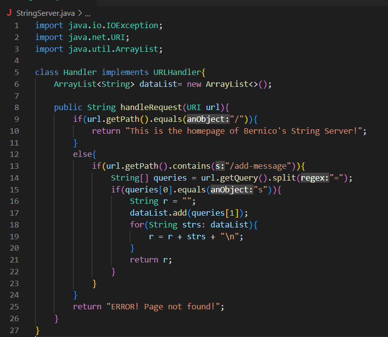
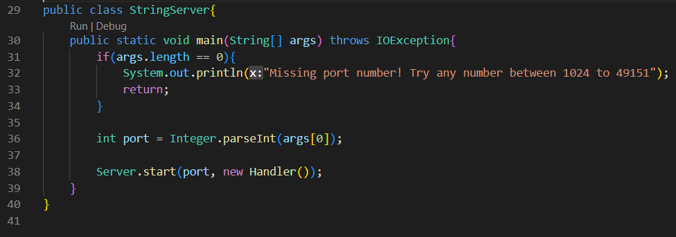

# CSE 15L Lab Report 2

Hi, my name's Bernico and today I will continue showing my progress in this class. Particularly, I will be showing what I've learned about setting up my own simple server and debugging. I will also be reflecting on what I've learned so far in these past two weeks.

## Part 1: Setting up My Own Server

On Lab 2, I learned about setting up my own local / remote server through the course's ssh. I will be showing the server I created that would display the strings the server stores after inputting said strings through the query of the server link. Basically, it's a server that's storing data of strings. The code that I wrote uses the Server.java file that the professor gave. This file handles the server starting and the handling of the backend program behind my server. I use it in the form of Server class's static method of `.start(int port, URLHandler handler)` that I use in my main method. The code that I wrote are displayed below.

To explain this code, this first screenshot contains my implementation of the `URLHandler` interface's method `handleRequest(URI url)`. It detects the `url` parameter's path content using `.getPath()`. If this is just "/", then the server should show the default home page. If it's anything else, then it gets to the `else` statement; here, 

