# Lab Report 4 - Doing it All from the Command Line

In this lab report, I will demonstrate how I used vim in the lab session as an exercise on improving my skill to use vim more effectively and quickly. I will be showing a set of tasks and provide screenshots and what keys I press for me to do each of them.

## Preparation and Pre-Setup
Before starting the timer, I do these pre-tasks.
1. First, I removed the folder that I used to do these tasks in during the lab session. This is done so that no tasks are skipped during this demonstration.

    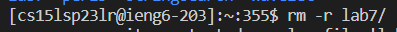

2. Second, I forked Professor Joe's [Sample Directory](https://github.com/ucsd-cse15l-w23/lab7) that will be used to demonstrate vim with.

    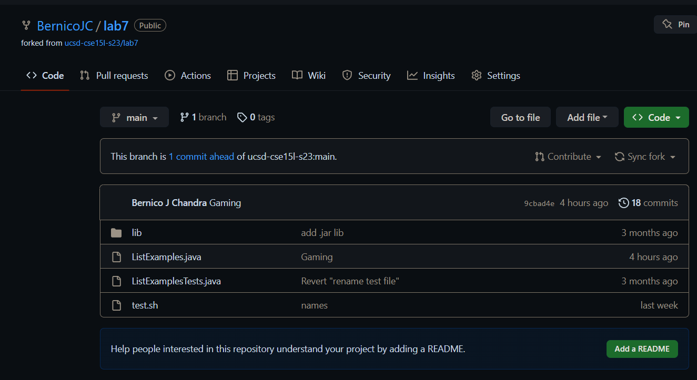

With these set up done, now I'm ready to start the stopwatch.

## Logging into ieng6
Logging in to the ieng6 server takes almost no time as I'm already well more than experienced in doing so through weeks of lab tasks involving doing this, coupled with the fact that I don't even need to enter my password anymore as it has already been saved through the SSH Keys task done in this week's lab. For the keys, all I did was type in `ssh` + `<space>` + `c` and then press `<tab>` and it automatically fills in my registered course ieng6 account. And then I hit enter, and then this step is done.

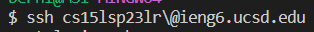

## Cloning the Fork
This step also takes almost no time. Since I already know the codes to type, I simply did. Type in `git clone `, and then go to the forked directory from before, click the "Code" symbol on top right of the page's content, click the "SSH" tab, and then copy the link provided. Go back to terminal, and then paste the link to the entered command's argument.

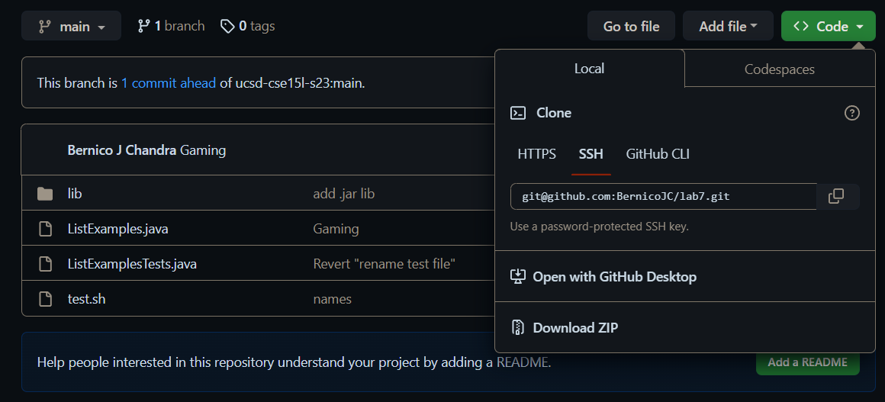

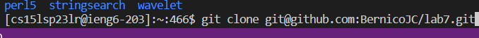

## Running the Test (with failure as a result)
After the previous step is done, I inputted `ls` and then `<enter>` to see if the correct directory has been cloned or not. Seeing that it has, I `cd la` and then click `<tab>` to autofill to `cd lab7/`, then click `<enter>`. There, I typed `bash test.sh` and then `<enter>` to run the test, and then showing that it failed a test.
PIC4

## Editing the Code
Then, I typed in `vim Lis`, and then `<tab>` to auto complete to `vim ListExamples` and then I typed in `.ja` and then `<tab>` again to auto fill to `vim ListExamples.java`, and then `<enter>`. Then, to edit the file, all I did was type in `?index1` and `<enter>` to search the last `index1` in the file (since I already know which part of the code to be fixed). Then, press `e` to reach the end of the word (the `1`), press `x` to delete it, press `i` to enter insert mode, type `2` so the index is the correct one and then `<esc>` to quit the insert mode, and finally type in `:wq` and then `<enter>` to save and exit the `ListExamples.java` vim. The code is now fixed.

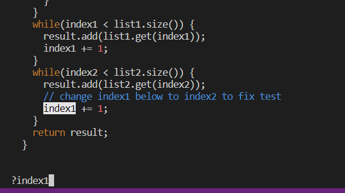
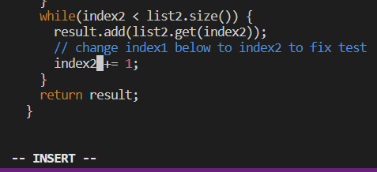
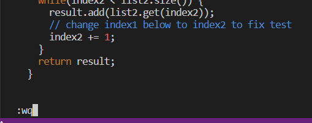

## Re-running the Test (with success this time)
This step is almost the same as the step to run the test, that is, I typed `bash test.sh` and then `<enter>` to run the test, and then showing that it didn't fail this time.

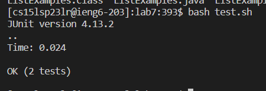

## Committing and Pushing to Github
Finally, I can commit and push to Github. First, I typed in `git add Lis` and then `<tab>`, and then finish `.ja` and then `<tab>` again and then `<enter>` like before to add the file that I changed. Then, I typed `git commit` and then `<enter>`; a vim terminal page will open. I pressed `i` to input mode and typed `Fixing the ListExamples.java file.` to describe what I did; then, click `<esc>` and then `:wq` to save and quit. Finally, enter `git push` and then `<enter>` to push the commit. And then finally, the code in the Github fork is fixed.

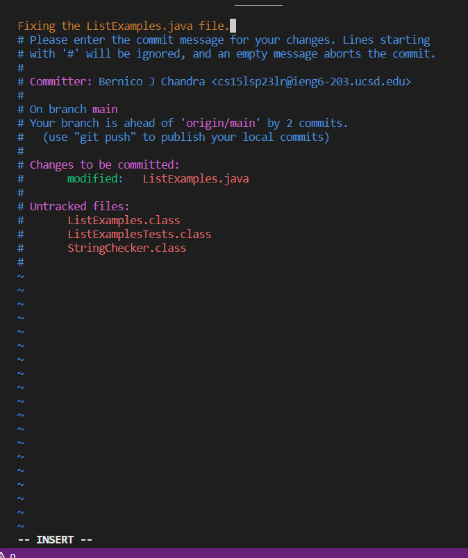
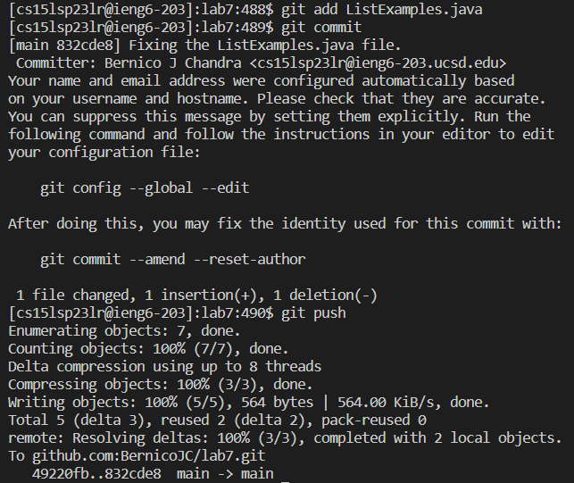
