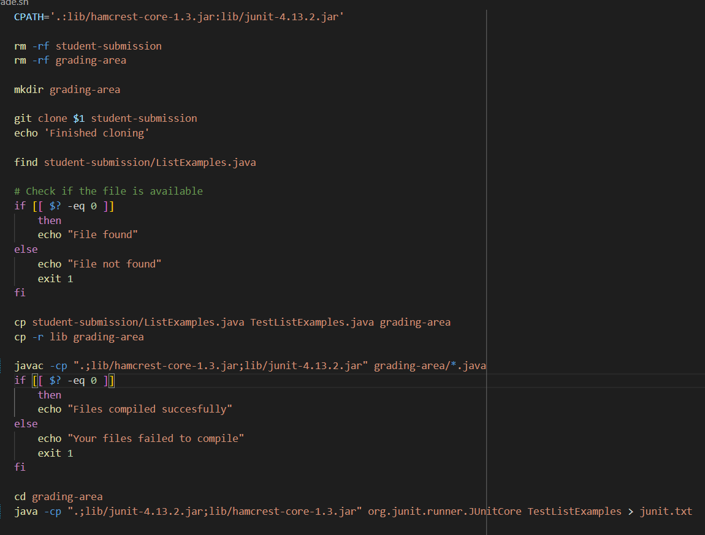
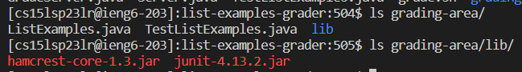
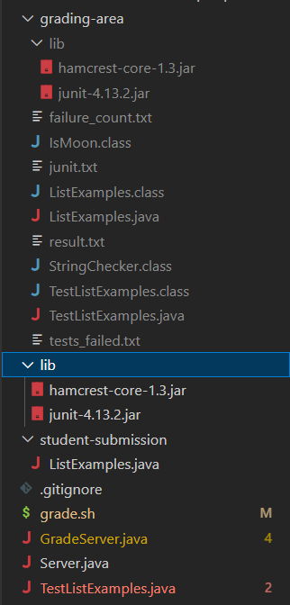

# Lab Report 5 - Putting it All Together

In this lab report, I will show a debugging scenario and describe how I'd answer a hypothetical debugging problem not unlike how it happens on edStem. Furthermore, I will also write my end-of-the-quarter reflection here.

## Debugging Scenario
### The Original Student's Question
**Title:** Unable to start the autograder script on ieng6 server

**What environment are you using (computer, operating system, web browser, terminal/editor, and so on)?**
MSI Windows Laptop, Windows 10, Chrome, bash terminal / Visual Studio Code

**Detail the symptom you're seeing. Be specific; include both what you're seeing and what you expected to see instead. Screenshots are great, copy-pasted terminal output is also great. Avoid saying “it doesn't work”.**
Hi, I'm trying to finish off my autograder script and it seemed to be working as intended when I tried to run it on my local terminal, same with local server. This is my intended output.

```
$ bash grade.sh https://github.com/ucsd-cse15l-f22/list-methods-corrected
Cloning into 'student-submission'...
remote: Enumerating objects: 3, done.
remote: Counting objects: 100% (3/3), done.
remote: Compressing objects: 100% (2/2), done.
remote: Total 3 (delta 0), reused 3 (delta 0), pack-reused 0
Receiving objects: 100% (3/3), done.
Finished cloning
student-submission/ListExamples.java
File found
Files compiled succesfully
Failures found
Out of 4 tests, you failed 3 :
1) testAlwaysFail(TestListExamples)
2) testAlwaysFail1(TestListExamples)
3) testAlwaysFail2(TestListExamples)
Your score is 25 out of 100
```

Meanwhile, when I tried to run it on the ieng6 server, this output shows up, which shows an error saying the files aren't compiling. This means that I can't even run the java file for starting the server.

```
Cloning into 'student-submission'...
remote: Enumerating objects: 3, done.
remote: Counting objects: 100% (3/3), done.
remote: Compressing objects: 100% (2/2), done.
remote: Total 3 (delta 0), reused 3 (delta 0), pack-reused 0
Receiving objects: 100% (3/3), done.
Finished cloning
student-submission/ListExamples.java
File found
grading-area/TestListExamples.java:1: error: package org.junit does not exist
import static org.junit.Assert.*;
                       ^
grading-area/TestListExamples.java:2: error: package org.junit does not exist
import org.junit.*;
^
grading-area/TestListExamples.java:13: error: cannot find symbol
  @Test(timeout = 500)
   ^
  symbol:   class Test
  location: class TestListExamples
grading-area/TestListExamples.java:22: error: cannot find symbol
  @Test
   ^
  symbol:   class Test
  location: class TestListExamples
grading-area/TestListExamples.java:26: error: cannot find symbol
  @Test
   ^
  symbol:   class Test
  location: class TestListExamples
grading-area/TestListExamples.java:30: error: cannot find symbol
  @Test
   ^
  symbol:   class Test
  location: class TestListExamples
grading-area/TestListExamples.java:19: error: cannot find symbol
    assertEquals(expected, merged);
    ^
  symbol:   method assertEquals(List<String>,List<String>)
  location: class TestListExamples
grading-area/TestListExamples.java:24: error: cannot find symbol
    assertFalse(true);
    ^
  symbol:   method assertFalse(boolean)
  location: class TestListExamples
grading-area/TestListExamples.java:28: error: cannot find symbol
    assertFalse(true);
    ^
  symbol:   method assertFalse(boolean)
  location: class TestListExamples
grading-area/TestListExamples.java:32: error: cannot find symbol
    assertFalse(true);
    ^
  symbol:   method assertFalse(boolean)
  location: class TestListExamples
10 errors
Your files failed to compile
```

Here is a screenshot of the bit that's probably triggering the bug, since it is where `"Your files failed to compile"` should be printed from.


**Detail the failure-inducing input and context. That might mean any or all of the command you're running, a test case, command-line arguments, working directory, even the last few commands you ran. Do your best to provide as much context as you can.**
The command that I did, as shown above, is `bash grade.sh https://github.com/ucsd-cse15l-f22/list-methods-corrected`. However, I'm pretty sure that it isn't the command-line argument that's causing this as it is the correct version with all of the infrastructures like the `ListExamples.java` file intact. My working directory for the ieng6 run was `[cs15lsp23lr@ieng6-203]:list-examples-grader:510`. I didn't run anything before the run on the ieng6 server, other than the usual `cd` and `ls` commands, along with `git clone ` method to clone the same repository I'm using on local.

### Leading question / command suggestion
Hi Bernico, looking over your error message, this seems to be an error with your script trying to run the tester file. Here are a few things that you should check out.
1. Since you're starting it fresh from the github, maybe your local directory has something set up that isn't yet established in the github repository. Try to check the directory you're running the commands in. In particular, try to make sure that the tester's library folder is in there. You can do this by doing `ls [folder name]` in said directory.
2. Try to look over your bash script and remember that the commands to compile java files can be different depending on the platform. Pay close attention to the fact that ieng6 server might be on a different platform than yours.

### The Student's Followup and the Bug Itself
Hi, thanks for your answer. For the first part, the code I cloned into the ieng6 server is the most up to date one as I pushed the local one into github right before I tried to do it in the server. And as for the directories I'm using to run the java file, the `ls` command gave me this.

As for the second part, I think it gave me the answer I needed. Apparently the bug was that the command line location for the tester library I used in my bash script is the one used for Windows, while ieng6 runs on Linux-based terminal. As such, I changed it and I got my intended output. Thanks once again for your help!

### The Extra Information
1. The file and directory structure needed



2. The contents of each relevant file before fixing the bug
grade.sh

```
rm -rf student-submission
rm -rf grading-area

mkdir grading-area

git clone $1 student-submission
echo "Finished cloning"

find student-submission/ListExamples.java

if [[ $? -eq 0 ]]
    then 
    echo "File found"
else  
    echo "File not found"
    exit 1
fi

cp student-submission/ListExamples.java TestListExamples.java grading-area
cp -r lib grading-area

javac -cp ".;lib/hamcrest-core-1.3.jar;lib/junit-4.13.2.jar" grading-area/*.java
if [[ $? -eq 0 ]]
    then 
    echo "Files compiled succesfully"
else
    echo "Your files failed to compile"
    exit 1
fi

cd grading-area
java -cp ".;lib/junit-4.13.2.jar;lib/hamcrest-core-1.3.jar" org.junit.runner.JUnitCore TestListExamples > junit.txt

grep "Failures:" junit.txt > result.txt
if [[ $? -eq 0 ]]
    then
    echo "Failures found"
    
    grep -oE "[0-9]+" result.txt > failure_count.txt
    testsRan=$(grep -m 1 "" failure_count.txt)
    fails=$(grep -m 2 "" failure_count.txt | sed -n "2p")
    echo "Out of" $testsRan "tests, you failed" $fails ":"

    testsRan_Int=$((testsRan))
    fails_int=$((fails))

    grep ") " junit.txt > tests_failed.txt

    cat "tests_failed.txt"

    score=$((100 - $fails_int * 100 / $testsRan_Int))
    echo "Your score is" $score "out of 100"


else
    echo "No errors. All tests passed"
    echo 100

fi
```

TestListExamples.java

```
import static org.junit.Assert.*;
import org.junit.*;
import java.util.Arrays;
import java.util.List;

class IsMoon implements StringChecker {
  public boolean checkString(String s) {
    return s.equalsIgnoreCase("moon");
  }
}

public class TestListExamples {
  @Test(timeout = 500)
  public void testMergeRightEnd() {
    List<String> left = Arrays.asList("a", "b", "c");
    List<String> right = Arrays.asList("a", "d");
    List<String> merged = ListExamples.merge(left, right);
    List<String> expected = Arrays.asList("a", "a", "b", "c", "d");
    assertEquals(expected, merged);
  }

  @Test
  public void testAlwaysFail(){
    assertFalse(true);
  }
  @Test
  public void testAlwaysFail1(){
    assertFalse(true);
  }
  @Test
  public void testAlwaysFail2(){
    assertFalse(true);
  }


}
```

3. The full command line (or lines) ran to trigger the bug
The command line done, as said above is `bash grade.sh https://github.com/ucsd-cse15l-f22/list-methods-corrected`, which isn't the one that's causing the bug. Meanwhile, the line that's causing the bug is `javac -cp ".;lib/hamcrest-core-1.3.jar;lib/junit-4.13.2.jar" grading-area/*.java` and, to an extent, `java -cp ".;lib/junit-4.13.2.jar;lib/hamcrest-core-1.3.jar" org.junit.runner.JUnitCore TestListExamples > junit.txt`.

4. A description of what to edit to fix the bug
What to edit to fix the bug is simple as I simply have to replace the path in the lines for compiling and running the java file to the mac / linux version of the path's format. So, it becomes `javac -cp .:lib/hamcrest-core-1.3.jar:lib/junit-4.13.2.jar grading-area/*.java` and `java -cp .:lib/junit-4.13.2.jar:lib/hamcrest-core-1.3.jar org.junit.runner.JUnitCore TestListExamples > junit.txt`.

## Reflection
I have definitely learned a lot throughout the quarter from this class, and its lab sessions in particular. For the actual materials from the course, I think that general terminal command lines and directory manipulating are the most important one that I learned about, along with operating git commands and github. Other than that, vim also comes in handy more time than I expected. Outside of materials however, I think I also learned about the importance of teamwork, as the lab session especially made me realize how much more effective I can be while working with others.
