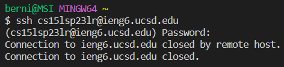

# CSE 15L Lab Report 1

Hi, my name's Bernico. This is my first ever CSE 15L lab section and I finally had several experiences dealing with tools such as ssh, file systems in terminal in general, and github (the website I'm using right now). On this page, I'm going to show a demo the experience of this lab and how to (_theoretically_) log into the UCSD ieng6 ssh account.

## Disclaimer

Before I begin, here are a couple of disclaimers about this "guide".
- I'm sure you are wondering why I put the word "theoretically" on my intro. Well, this is because, when my lab was in session, there was an issue with the ieng6 ssh server such that I couldn't log in with my course specific account. ieng6.ucsd.edu would immediately be closed by a remote host everytime I would try to log in (pictured below). As such, I will just share about what **I** did, which was mostly trying to do the same thing instructed, but using my UCSD-wide account.

  
  
- Other than that, there are some of the steps in my demo that's not the same for everyone. This might be the case since either I've already had something installed and thus didn't need to do it in the lab, or because of the aforementioned trouble with the UCSD server. In these cases, I will mention what I skipped and briefly explain how it would normally be done.

---

## Part 1: Installing Visual Studio Code

This is one of the parts that I skipped entirely. This is entirely because of the fact that I've already used Visual Studio Code long before the start of the class, and as such has had it installed and ready to use. However, for the sake of completion, I will briefly demo a small guide on how to install it.
1. Go to https://code.visualstudio.com/download, and click download on the platform you're using.
2. After downloaded, open the installer and just follow the instructions given, like agreeing to the terms and conditions.
3. There are more settings that can be chosen in the installation, but the default options seemed good enough.

    
  
5. Open VSCode and it's ready to go.

## Part 2: Remotely Connecting

Before being able to connect, you should first set up your CSE 15L account's password.
1. https://sdacs.ucsd.edu/~icc/index.php go to this link and log in with your UCSD username and PID in the "Account Lookup" section.
2. Next, look to the "Additional Accounts" section of the page and click the button of your course account (as exemplified below).

   
  
3. Copy the username, and proceed with the "Global Password Change Tool" link, and then select "Proceed to the Password Change Tool" on the next page.
4. Input said copied username and click continue.
  
   
  
6. Click the reset password button. You will be prompted to confirm using Duo.
7. You will be asked if you would want to be emailed (in your main UCSD account) to reset the password. Click yes and then click the link that's sent to your email and input your desired password.

Next, before we can connect to the ssh, we need to set up git for the PC as a whole and VSCode.
1. https://gitforwindows.org/ go to this link and download the Git installer. The link provided is for 64-bit Windows. The other download links can be found here https://git-scm.com/downloads.
2. Install git using the installer. There will be a lot of options in the installation. However, for the sake of simplicity, just ignore them and install the defaulted options.
3. Open Visual Studio Code, and open Terminal. You can input `` Ctrl + ` `` on your keyboard to do this.
4. Next, input `Ctrl + Shift + P` in your keyboard to open the command palette and select (or search) "Terminal: Select Default Profile" like so.

   
  
5. Select "Git Bash".
6. Input `` Ctrl + Shift + ` `` in your keyboard to open a new terminal which would be in Git bash.

Finally, we're ready to actually connect to the ssh... if the server was actually working when I was in my lab session. Instead, I will simply show my workaround during the session using my UCSD email instead. However, if this problem is also happening in the future, the other workaround is by adding -202 after ieng6 in your username.
1. Enter to the terminal `ssh <your course username>@ieng6.ucsd.edu`. There will be a disclaimer that looks something like this that you can just answer yes.
  
    
  
2. It will then prompt a password input. Type your password in nevertheless the fact that you can't see any of the keys you typed in. This was apparently a security measure, and your password will still be typed and be inputted once you hit enter.
  
    
  
3. You have now enterred the ssh in the ~ or home directory of your username.

## Part 3: Run Some Commands

Now that we're already in the server, let's try out some commands.
Here are some of the commands that the professor provided as examples:

To input the commands, simply type them and hit enter on the terminal. Below is an example snipet of what I did during the lab.

Here are my general explanations as to what the commands I entered did:
- cd switches the current working directory to the directory location given afterward
  - cd ~ switches the directory to the "home" one. I did this because I didn't know which directory I was in (and forgot the command pwd), and I wanted to make sure I didn't edit any other people's folder.
  - cd .. switches the directory to the one before the current working directory, essentially going to the closest directory that's currently containing the current working directory.
- pwd displays the path of my current working directory.
- ls generally lists the directories (folders) that were in my current working directory.

I also tried other codes after the lab session using the -202 workaround.

I am not sure about what ls -a and ls -lat do, but I know they're listing files. The command cp I inputted copies the "hello.txt" file in the public folder and pastes it inside my current directory (which was ~). The cat command prints the content inside "hello.txt".

After done with trying out the commands, you can log out by inputting `Ctrl + D`.
